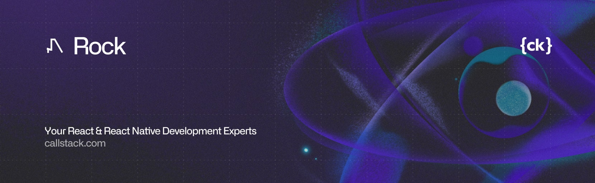

<a href="https://www.callstack.com/open-source?utm_campaign=generic&utm_source=github&utm_medium=referral&utm_content=rock" align="center">
  <picture>
    
  </picture>
</a>
<p align="center">
  🪨 Rock is a cross-platform React Native app development and build toolchain built for modularity, build reuse, and incremental adoption. It integrates seamlessly with your existing infrastructure, giving you complete control without vendor lock-in.
</p>

---

## React Native at scale is challenging

Successful apps developed by large teams aren't built overnight. At Callstack, we've seen these challenges at scale: high build times, difficulty adopting new third-party cloud services, struggling with microfrontends setup, and high barriers to introducing React Native into existing iOS and Android apps.

Rock simplifies native build setup and reuse, makes it easy to adopt React Native in existing iOS and Android apps, and helps you deliver your app to multiple platforms using microfrontends and super apps if you need it.

## Features

**☁️ Remote Build Cache**  
Save up to 96% of build time by reusing native artifacts (APK, AAB, APP, IPA). Store anywhere or use our GitHub, S3, or R2 integrations.

**🔗 Brownfield without the pain**  
Add React Native to existing iOS and Android apps without disrupting existing tech stack by using Rock Brownfield.

**📦 Microfrontends & Super Apps**  
First‑class support for Re.Pack and Metro Module Federation to build mobile microfrontends and super apps.

**🔌 Modular & Extensible**  
A plugin‑driven architecture that lets you customize platforms, bundlers, cache providers, and more.

**🖥️ Cross‑platform-ready**  
iOS and Android by default; designed to extend to TVs, macOS, and Windows (coming soon).

**⚡ Easy Community CLI Migration**  
A familiar CLI that helps you develop, run, and build your app. Integrates with Remote Build Cache. Migrate from Community CLI in minutes.

## Installation

Rock is designed for incremental adoption. Whether you're just starting with React Native in your iOS or Android app, or want to migrate from the React Native Community CLI, you can do it step-by-step without having to figure everything out at once.

### Migrating an existing Community CLI project

To migrate an existing project, open a terminal in your project root and run:

```shell
npm create rock
```

### Creating a new project

To create a fresh React Native app with Rock, open a terminal and run:

```shell
npm create rock
```

### Adding to an existing native project

To add React Native to an existing iOS or Android app with Rock, use our Brownfield plugins:

```shell
npm create rock
# ...
◆  What plugins do you want to start with?
│  ◼ brownfield-ios
│  ◼ brownfield-android
```

For detailed instructions, please follow our [Integrating with Native Apps](https://rockjs.dev/docs/brownfield/intro) documentation.

## Documentation

Visit [rockjs.dev](https://rockjs.dev) to learn more about the framework, why we created it, how it can be useful to you, and how to use it in more advanced scenarios.

## Contributing

Read our [contributing guidelines](CONTRIBUTING.md) to learn how you can contribute with bug reports, documentation, and code.

## Made with ❤️ at Callstack

Rock is an open source project and will always remain free to use. If you think it's cool, please star it 🌟. [Callstack](https://www.callstack.com/?utm_source=github.com&utm_medium=referral&utm_campaign=rock&utm_term=readme-with-love) is a group of React and React Native geeks. Contact us at [hello@callstack.com](mailto:hello@callstack.com) if you need any help with these technologies or just want to say hi!
