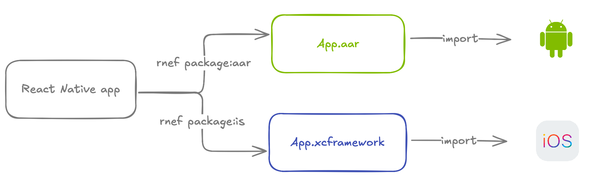

# Integrating with Native Apps

Rock, when extended with `@rock-js/plugin-brownfield-ios` and `@rock-js/plugin-brownfield-android` plugins and the [React Native Brownfield](https://github.com/callstack/react-native-brownfield) library, allows you to package all of your React Native code into native libraries (XCFramework for iOS, AAR for Android) that you can easily integrate into your existing iOS and Android apps. This "packaging approach," as we call it, allows us to achieve a radically simpler experience for native iOS and Android developers who want to integrate React Native into their apps.

With this approach, there's **no need for you to**:

- set up Node.js in your main app
- configure CocoaPods for iOS
- change your project directory structure
- depend on React Native's own dependencies in your build tools

## Getting Started

Choose your platform to begin:

- [Android Integration](./android.md) - Add React Native to your Android app
- [iOS Integration](./ios.mdx) - Add React Native to your iOS app
