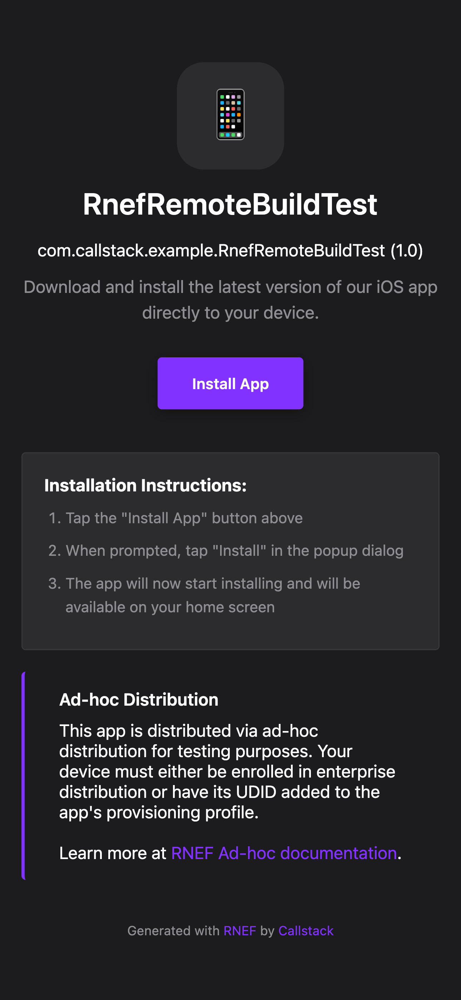
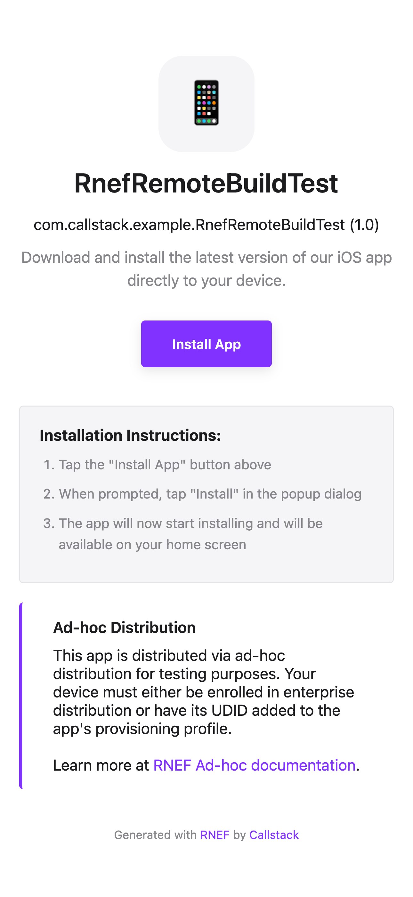

# Configuration

Rock can be configured through a configuration object that defines various aspects of your project setup.

The most basic configuration would, assuming you only support iOS platform and choose Metro as our bundler, would look like this:

```js title="rock.config.mjs"
// @ts-check
import { platformIOS } from '@rock-js/platform-ios';
import { pluginMetro } from '@rock-js/plugin-metro';

/** @type {import('rock').Config} */
export default {
  bundler: pluginMetro(),
  platforms: {
    ios: platformIOS(),
  },
};
```

:::info Explicit configuration
It's intentional design decision to explicitly define platforms, bundlers etc, so you can e.g. add more platforms, or replace a bundler with a different one.
:::

## All Configuration Options

```typescript
{
  // Optional: Root directory of your project
  root?: string;

  // Optional: React Native version being used
  reactNativeVersion?: string;

  // Optional: Custom path to React Native in node_modules
  reactNativePath?: string;

  // Optional: Custom bundler plugin
  bundler?: PluginType;

  // Optional: Array of plugins
  plugins?: Array<PluginType>;

  // Optional: Platform-specific configurations
  platforms?: Record<string, PlatformType>;

  // Optional: Additional commands
  commands?: Array<Command>;

  // Optional: Configure remote cache provider. Currently supports: 'github-actions' or custom provider (function).
  remoteCacheProvider?: 'github-actions' | () => RemoteBuildCache |  null;

  fingerprint?: {
    // Additional source files/directories to include in fingerprint calculation
    extraSources?: string[];

    // Paths to ignore when calculating fingerprints
    ignorePaths?: string[];

    // Environmental variables that should affect fingerprints
    env?: string[];
  }
}
```

## Plugins

A plugin is a partially applied function that has access to `api` object of `PluginApi` type:

```ts
type PluginApi = {
  registerCommand: (command: CommandType) => void;
  getProjectRoot: () => string;
  getReactNativeVersion: () => string;
  getReactNativePath: () => string;
  getPlatforms: () => { [platform: string]: object };
  getRemoteCacheProvider: () => null | undefined | (() => RemoteBuildCache);
  getFingerprintOptions: () => {
    extraSources: string[];
    ignorePaths: string[];
    env: string[];
  };
};
```

The following configuration options accept plugins: [`plugins`](#plugins), [`platforms`](#platforms), [`bundler`](#bundlers).

A plugin that registers `my-command` command outputing a hello world would look like this:

```ts title="rock.config.mjs"
const simplePlugin =
  (pluginConfig: SamplePluginConfig) =>
  (api: PluginApi): PluginOutput => {
    api.registerCommand({
      name: 'my-command',
      description: 'My command description',
      action: async (args) => {
        console.log('hello world');
      },
    });
  };

export default {
  plugins: [simplePlugin()],
};
```

## Bundler

Bundler is a plugin that registers commands for running a dev server and bundling final JavaScript or Hermes bytecode.

By default, Rock ships with two bundler: Metro (`@rock-js/plugin-metro`) and Re.Pack (`@rock-js/plugin-repack`).

You can configure the bundler like this:

```js title="rock.config.mjs"
import { pluginMetro } from '@rock-js/plugin-metro';

export default {
  // ...
  bundler: pluginMetro(),
};
```

## Platforms

Platform is a plugin that registers platform-specific functionality such as commands to build the project and run it on a device or simulator.

By default, Rock ships with two platforms: iOS (`@rock-js/platform-ios`) and Android (`@rock-js/platform-android`).

You can configure the platform like this:

```js title="rock.config.mjs"
import { platformIOS } from '@rock-js/platform-ios';

export default {
  // ...
  platforms: {
    // config is optional; it translates to `project` config from react-native.config.js file
    ios: platformIOS(config),
  },
};
```

## Remote Cache Configuration

One of the key features of Rock is remote build caching to speed up your development workflow. By remote cache we mean native build artifacts (e.g. APK, or IPA binaries), which are discoverable by the user and available for download. Remote cache can live on any static storage provider, such as S3, R2, or GitHub Artifacts. For Rock to know how and where to access this cache, you'll need to define `remoteCacheProvider`, which can be either bundled with the framework (such as the one for GitHub Actions) or a custom one that you can provide.

When `remoteCacheProvider` is set, the CLI will:

1. Look at local cache under `.rock/` directory for builds downloaded from a remote cache.
1. If not found, it will look for a remote build matching your local native project state (a fingerprint).
1. If not found, it will fall back to local build.

Available providers you can use:

- [@rock-js/provider-github](#github-actions-provider): store artifacts on GitHub Workflow Artifacts
- [@rock-js/provider-s3](#aws-s3-provider): store artifacts on S3 (or Cloudflare R2)

In case you would like to store native build artifacts in a different kind of remote storage, you can implement your own [custom provider](#custom-remote-cache-provider).

### Uploading artifacts to remote storage

Regardless of remote cache provider set, to download native build artifats from a remote storage, you'll need to upload them first, ideally in a continuous manner. That's why the best place to put the upload logic would be your Continuous Integration server.

Rock provides out-of-the-box GitHub Actions for:

- [`callstackincubator/ios`](https://github.com/callstackincubator/ios): action for iOS compatible with `@rock-js/provider-github`
- [`callstackincubator/android`](https://github.com/callstackincubator/android): action for Android compatible with `@rock-js/provider-github`

For other CI providers you'll need to manage artifacts yourself. We recommend mimicking the GitHub Actions setup on your CI server.

### GitHub Actions provider

If you store your code on GitHub, one of the easiest way to setup remote cache is through `@rock-js/provider-github` and our GitHub Actions, which will manage building, uploading and downloading your native artifacts for iOS and Android.

You can configure it as follows:

```ts title="rock.config.mjs"
import { providerGitHub } from '@rock-js/provider-github';
import { config } from 'dotenv';
config(); // load .env file containing GITHUB_TOKEN

export default {
  // ...rest of the config
  remoteCacheProvider: providerGitHub({
    owner: 'github_org',
    repository: 'github_repo_name',
  }),
};
```

GitHub provider requires a valid GitHub Personal Access Token to fetch remote cache. Typically, you'll use `.env` file to store your GitHub Personal Access Token as `GITHUB_TOKEN`, next to other project secrets securely, not exposing it to the public.

```text title=".env"
GITHUB_TOKEN=token_value
```

In case you use a different env variable, you can pass it as a `token` argument to the `providerGitHub` function.

#### GitHub Provider Options

| Option  | Type     | Required | Description                                                        |
| ------- | -------- | -------- | ------------------------------------------------------------------ |
| `repo`  | `string` | Yes      | The repository name to use for the GitHub server                   |
| `owner` | `string` | Yes      | The bucket name to use for the S3 server                           |
| `token` | `string` | No       | Optional GitHub Personal Access Token to use for the GitHub server |

### AWS S3 provider

If you prefer to store native build artifacts on AWS S3 or Cloudflare R2, you can use `@rock-js/provider-s3`. You can configure it as follows.

```ts title="rock.config.mjs"
import { providerS3 } from '@rock-js/provider-s3';
import { config } from 'dotenv';
config(); // load .env file containing AWS_ACCESS_KEY_ID and AWS_SECRET_ACCESS_KEY

export default {
  // ...rest of the config
  remoteCacheProvider: providerS3({
    bucket: 'your-bucket',
    region: 'your-region',
  }),
};
```

S3 provider requires a valid AWS Access Key ID and Secret Access Key to fetch remote cache. Typically, you'll use `.env` file to store your AWS Access Key ID and Secret Access Key as `AWS_ACCESS_KEY_ID` and `AWS_SECRET_ACCESS_KEY`, next to other project secrets securely, not exposing it to the public.

```text title=".env"
AWS_ACCESS_KEY_ID=...
AWS_SECRET_ACCESS_KEY=...
```

In case you use a different env variable, you can pass it as a `accessKeyId` and `secretAccessKey` arguments to the `providerS3` function.

#### S3 Provider Options

| Option               | Type     | Required | Description                                                                                      |
| -------------------- | -------- | -------- | ------------------------------------------------------------------------------------------------ |
| `endpoint`           | `string` | No       | Optional endpoint, necessary for self-hosted S3 servers or Cloudflare R2 integration             |
| `bucket`             | `string` | Yes      | The bucket name to use for the S3 server                                                         |
| `region`             | `string` | Yes      | The region of the S3 server                                                                      |
| `accessKeyId`        | `string` | No       | The access key ID for the S3. Not required when using IAM roles or other auth methods server     |
| `secretAccessKey`    | `string` | No       | The secret access key for the S3. Not required when using IAM roles or other auth methods server |
| `profile`            | `string` | No       | AWS profile name to use for authentication. Useful for local development.                        |
| `roleArn`            | `string` | No       | Role ARN to assume for authentication. Useful for cross-account access.                          |
| `roleSessionName`    | `string` | No       | Session name when assuming a role.                                                               |
| `externalId`         | `string` | No       | External ID when assuming a role (for additional security).                                      |
| `directory`          | `string` | No       | The directory to store artifacts in the S3 server (defaults to `rock-artifacts`)                 |
| `name`               | `string` | No       | The display name of the provider (defaults to `S3`)                                              |
| `linkExpirationTime` | `number` | No       | The time in seconds for presigned URLs to expire (defaults to 24 hours)                          |

#### Authentication Methods

The S3 provider supports multiple authentication methods through the underlying AWS SDK:

- **Environment variables**: Set `AWS_ACCESS_KEY_ID`, `AWS_SECRET_ACCESS_KEY`, and optionally `AWS_SESSION_TOKEN` for temporary credentials
- **IAM roles**: When running on EC2, ECS, or Lambda, the SDK automatically uses the instance/task/function role
- **AWS credentials file**: Use `~/.aws/credentials` with the `profile` option
- **Role assumption**: Use `roleArn` to assume a different role, optionally with `profile` as source credentials
- **Temporary credentials**: Set `AWS_SESSION_TOKEN` environment variable for temporary credentials
- **Public access**: When no credentials are provided, the provider configures a custom signer that doesn't sign requests, allowing access to public S3 buckets without authentication

#### Cloudflare R2

Thanks to R2 interface being compatible with S3, you can store and retrieve your native build artifacts from Cloudflare R2 storage using S3 provider. Set the `endpoint` option to point to your account storage.

```ts title="rock.config.mjs"
import { providerS3 } from '@rock-js/provider-s3';

export default {
  // ...
  remoteCacheProvider: providerS3({
    endpoint: 'https://${ACCOUNT_ID}.r2.cloudflarestorage.com',
    bucket: 'your-bucket',
    region: 'your-region',
    accessKeyId: 'access-key',
    secretAccessKey: 'secret-key',
  }),
};
```

### Custom remote cache provider

You can plug in any remote storage by implementing the `RemoteBuildCache` interface. This section explains how to implement each method and handle the complexity that Rock manages for you.

#### Interface

Your provider must implement:

```ts
interface RemoteBuildCache {
  name: string;

  list({
    artifactName,
    limit,
  }: {
    artifactName: string | undefined;
    limit?: number;
  }): Promise<Array<{ name: string; url: string; id?: string }>>;

  download({ artifactName }: { artifactName: string }): Promise<Response>;

  delete({
    artifactName,
    limit,
    skipLatest,
  }: {
    artifactName: string;
    limit?: number;
    skipLatest?: boolean;
  }): Promise<Array<{ name: string; url: string; id?: string }>>;

  upload({
    artifactName,
    uploadArtifactName,
  }: {
    artifactName: string;
    uploadArtifactName?: string; // e.g. 'ad-hoc/<artifact>/<file>'
  }): Promise<{
    name: string;
    url: string;
    id?: string;
    getResponse: (
      buffer: Buffer | ((baseUrl: string) => Buffer),
      contentType?: string,
    ) => Response;
  }>;
}
```

#### list

Return a list of artifacts with at least `name` and a downloadable `url`. Optionally add an `id`.

:::info
The artifacts are uploaded as ZIP archives (excluding ad-hoc scenario), so make sure to append the `.zip` suffix to the `artifactName`.
:::

**Example (S3-style):** prefix-filter objects and convert each to `{ name, url }`. Signed URLs are fine.

```ts
async list({ artifactName, limit }) {
  const artifacts = await this.s3.send(
    new ListObjectsV2Command({
      Bucket: this.bucket,
      Prefix: artifactName
        ? `${this.directory}/${artifactName}.zip`
        : `${this.directory}/`,
    })
  );

  const results = [];
  for (const artifact of artifacts.Contents ?? []) {
    if (!artifact.Key) continue;

    const name = artifactName ?? artifact.Key.split('/').pop() ?? '';
    const presignedUrl = await getSignedUrl(/* ... */);

    results.push({ name, url: presignedUrl });
  }

  return results;
}
```

#### download

Return a Web `Response` whose `body` is a readable stream of the artifact and (if available) a `content-length` header. Rock uses this to report download progress.

:::info
The artifacts are uploaded as ZIP archives (excluding ad-hoc scenario), so make sure to append the `.zip` suffix to the `artifactName`.
:::

If your SDK returns a Node stream, convert it to a Web stream and wrap in `Response`:

```ts
function toWebStream(node: Readable): ReadableStream {
  return new ReadableStream({
    start(controller) {
      node.on('data', (chunk) => controller.enqueue(chunk));
      node.on('end', () => controller.close());
      node.on('error', (e) => controller.error(e));
    },
  });
}

async download({ artifactName }) {
  const res = await this.s3.send(
    new GetObjectCommand({
      Bucket: this.bucket,
      Key: `${this.directory}/${artifactName}.zip`,
    })
  );

  return new Response(toWebStream(res.Body), {
    headers: {
      'content-length': String(res.ContentLength ?? ''),
    },
  });
}
```

#### delete

Delete the requested artifact(s) and return the list of deleted entries: `{ name, url, id? }`.

:::info
The artifacts are uploaded as ZIP archives (excluding ad-hoc scenario), so make sure to append the `.zip` suffix to the `artifactName`.
:::

Respect `skipLatest` if your backend supports ordering/versioning, as it's used to clean up stale artifacts e.g. created in an open pull request. Otherwise you may simply delete the single matching object.

```ts
async delete({ artifactName, skipLatest }) {
  if (skipLatest) {
    // Skip the latest artifact - implement based on your backend's versioning
    return [];
  }

  await this.s3.send(
    new DeleteObjectCommand({
      Bucket: this.bucket,
      Key: `${this.directory}/${artifactName}.zip`,
    })
  );

  return [{
    name: artifactName,
    url: `${this.bucket}/${this.directory}/${artifactName}.zip`,
  }];
}
```

#### upload

Rock expects `upload()` to return metadata and a `getResponse` function:

- `getResponse(buffer, contentType?) => Response`:
  - Rock calls this to initiate the upload and to surface upload progress
  - It passes either:
    - a `Buffer` (for normal builds), or
    - a function `(baseUrl) => Buffer` (for ad‑hoc pages) so you can inject absolute URLs into HTML/plist before upload
  - You should start the actual upload here and return a `Response` object
  - Rock will read that stream to display progress
- for ad-hoc scenario `upload` will pass the `uploadArtifactName` variable, so use that instead of `artifactName`

**For progress signaling, you can:**

- Stream the original buffer in chunks, or
- Use your SDK's progress events (e.g. S3's `httpUploadProgress`) to enqueue chunks proportional to actual bytes uploaded

**Example (S3-like) using real SDK progress:**

```ts
async upload({ artifactName, uploadArtifactName }) {
  const key = uploadArtifactName
    ? `${this.directory}/${uploadArtifactName}`
    : `${this.directory}/${artifactName}.zip`;

  const presignedUrl = await getSignedUrl(/* ... */);

  return {
    name: artifactName,
    url: presignedUrl,
    getResponse: (buffer, contentType) => {
      const upload = new Upload({
        client: this.s3,
        params: {
          Bucket: this.bucket,
          Key: key,
          Body: buffer,
          ContentType: contentType ?? 'application/octet-stream',
          Metadata: { createdAt: new Date().toISOString() },
        },
      });

      const stream = new ReadableStream({
        start(controller) {
          let last = 0;
          upload.on('httpUploadProgress', ({ loaded, total }) => {
            if (loaded != null && total != null && loaded > last) {
              controller.enqueue(buffer.subarray(last, loaded));
              last = loaded;
              if (loaded >= total) controller.close();
            }
          });
          upload.done().catch((e) => controller.error(e));
        },
      });

      return new Response(stream, {
        headers: {
          'content-length': String(buffer.length),
          'content-type': contentType ?? 'application/octet-stream',
        },
      });
    },
  };
}
```

#### What ends up on the provider

- **Normal builds:** Rock uploads a single build artifact (a ZIP archive). Your provider stores it at a path like `<directory>/<artifactName>.zip`.
  - For iOS simulator builds (APP directory), Rock creates a temporary `app.tar.gz` to preserve permissions and includes it in the artifact; you just receive the buffer via `getResponse`. You don't need to create the tarball yourself.
- **Ad-hoc distribution:**
  - with `--ad-hoc` flag passed to `remote-cache upload` Rock uploads:
    - The signed IPA at `<directory>/ad-hoc/<artifactName>/<AppName>.ipa`
    - An `index.html` landing page (make sure it's accessible for testers)
    - A `manifest.plist`

  This `index.html` file will display an ad-hoc distribution web portal, allowing developers and testers to install apps on their provisioned devices by simply clicking "Install App".

  Learn more about ad-hoc distribution and how it works with `remote-cache upload --ad-hoc` command [here](./cli/introduction#ad-hoc-distribution).

  | Ad-hoc distribution web portal       | Ad-hoc distribution web portal        |
  | ------------------------------------ | ------------------------------------- |
  |  |  |

#### Notes and tips

- If your backend cannot support uploads, throw in `upload()` with a link to docs (as GitHub provider does).
- Always return valid, downloadable `url`s from `list()`; signed URLs are OK.
- Prefer setting `content-length` on both download and upload `Response` objects so Rock can display progress.
- For uploads, it's fine to start the SDK upload in the background; Rock drains the returned `Response` to show progress, and your SDK promise resolves independently. In tests, mock your SDK's upload to resolve quickly.

**Example provider:**

```ts
import type { RemoteBuildCache } from '@rock-js/tools';

class DummyLocalCacheProvider implements RemoteBuildCache {
  name = 'dummy';

  async list({ artifactName }) {
    const url = new URL(`${artifactName}.zip`, import.meta.url);
    return [{ name: artifactName, url }];
  }

  async download({ artifactName }) {
    const artifacts = await this.list({ artifactName });
    const filePath = artifacts[0].url.pathname;
    const fileStream = fs.createReadStream(filePath);
    return new Response(fileStream);
  }

  async delete({ artifactName }) {
    // optional...
  }

  async upload({ artifactName, uploadArtifactName }) {
    // optional...
  }
}

const pluginDummyLocalCacheProvider = (options) => () =>
  new DummyLocalCacheProvider(options);
```

Then use it in your config:

```ts title="rock.config.mjs"
export default {
  // ...
  remoteCacheProvider: pluginDummyLocalCacheProvider(options),
};
```

### Opt-out of remote cache

If you only want to use the CLI without the remote cache, and skip the steps `1.` and `2.` and a warning that you're not using a remote provider, you can disable this functionality by setting it to `null`:

```ts
export default {
  // ...
  remoteCacheProvider: null,
};
```

## Fingerprint Configuration

A fingerprint is a representation of your native project in a form of a hash (e.g. `378083de0c6e6bb6caf8fb72df658b0b26fb29ef`). It's calculated every time the CLI is run. When a local fingerprint matches the one that's generated on a remote server, we have a match and can download the project for you instead of building it locally.

The fingerprint configuration helps determine when builds should be cached and invalidated in non-standard settings:

- `extraSources`: when you have git submodules in your project
- `ignorePaths`: custom directories that are not relevant for the native build state
- `env`: environment variables that should affect the fingerprint

```ts
export default {
  // ...
  fingerprint: {
    extraSources: ['./git-submodule'],
    ignorePaths: ['./temp'],
    env: [process.env.CUSTOM_ENV],
  },
};
```
